<p align="center">
  <a href="https://github.com/ace-code-engine/hooh-agent/actions/workflows/ci.yml"></a>
  
  <a href="LICENSE"></a>
  
  
  
  <a href="CHANGELOG.md"></a>
</p>

<h1 align="center">HooH · 互</h1>

<p align="center">
  简体中文 · <a href="README.md">English</a> · <a href="CHANGELOG.md">更新日志</a> · <a href="docs/README.md">文档索引</a>
</p>

<p align="center">
  <strong>把安全边界放在模型<b>之下</b>的执行层。<br>
  模型提出动作，权限、隔离、快照与回滚由它无法辩解的代码裁决。</strong>
</p>

---

HooH 是面向编码代理的**执行层**。每一次工具调用 —— 文件、命令、出网、MCP —— 都要经过同一个裁决点：
权限闸门、路径与敏感目标边界、写前快照、HMAC 链式审计。安全核心为**纯标准库**；提示词失效时这道
边界仍然成立（越狱、注入内容、被篡改的工具输出都改变不了它）。

> **互（HooH）** —— 模型提出、代码裁决；先写快照，`/undo` 才谈得上意义。
> 名字是致意，不是素材占用，见下方「名称与致意」。

## 和别的 Agent 差在哪

- **安全在模型之下、不在提示词里。** 权限、路径、沙箱、回滚都是 harness 代码。
- **默认只读。** 提权是人的动作（`/permission write`）。
- **每次写前物理快照 + `/undo`**，HMAC 签名，快照目录 Agent 自己不可写。
- **自我驱动。** 持久目标、子代理、一行命令切换 **9 家厂商 · 10 入口**。

## 拿到手

每个版本发布四种产物，是**并列的四条路**，不是要叠加的层：

| 形态 | 产物 | 什么时候选它 |
|---|---|---|
| **① 直接用 HooH 当你的 agent** | `hooh-<版本>-windows-amd64.msi` · `.zip` | 你需要一个能自己干活的终端 agent |
| **② 把 HooH 当 MCP 服务（自带环境）** | `hooh-mcp-<版本>-<平台>.zip` | 你已经在用 Cline / Claude Desktop / Cursor，只想加边界、不改它。**自包含，不需要 Python** |
| **③ MCP 包（源码版）** | `hooh-mcp-server-<版本>.zip` | 同 ②，但你想读/改源码；需要 Python 3.10+ |
| **④ MCP + 沙箱底座（一体包）** | `hooh-sandbox-bundle-<版本>.zip` | 你既要裁决边界，也要执行边界（KVM microVM） |

## 快速开始

```bash
python ai_code.py --mock    # 离线演示 —— 不需要密钥、不需要网络
python ai_code.py           # 接入真实模型（向导引导）
```

在仓库里也可以直接用启动器，它会自己找一个能用的 Python：
`hooh.cmd --mock`（Windows）—— `ace.cmd` 作为同一个入口的别名保留。

Windows 没装 Python：去 [Releases](https://github.com/ace-code-engine/hooh-agent/releases) 拿 zip，
跑 `ace\ace.exe --mock`。安装与构建：[docs/PACKAGING-EXE.md](docs/PACKAGING-EXE.md)。

<p align="center">
  
</p>

## 1.1.0 更新了什么

- **界面按一份规范重做**：不画边框（改用整宽细线）、一屏一个强调色、左对齐；小零件（分隔线、
  六态状态图标、八分之一块进度条、byline、快捷键提示）**与终端渲染器逐值对拍**，不许两种长相。
- **中 / 英 / 日 三套齐全**：`/lang` 切的是**界面**语言 —— 斜杠菜单、对话框、报错、底栏一起换
  （不再顺手改"回答用什么语言"）。
- **上下文窗口跟着模型走**：DeepSeek → 1M，GLM-4.6/4.7 → 200K，表里条目带官方出处；表外模型走
  安全兜底**并明确提示**。新增 `/window 1m` 一条命令校正。
- **全屏真的能用**：`--fullscreen` 给转录一个自己的滚动视口（`PgUp/PgDn/↑↓/g/G` + 滚动条）；
  另加**同步输出**（`\u001b[?2026`）治频闪、`<Static>` 让主屏保住真实回滚缓冲。

## 文档

| 想找什么 | 去这里 |
|---|---|
| 5 分钟上手 · 十个经典陷阱 | [docs/GETTING-STARTED.md](docs/GETTING-STARTED.md) |
| HooH 能挡什么 / 挡不住什么 | [docs/security/SECURITY-FAQ.md](docs/security/SECURITY-FAQ.md) |
| 分层架构 · 完整目录树 · ADR | [docs/ARCHITECTURE.md](docs/ARCHITECTURE.md) |
| 全部命令与参数 | [docs/COMMANDS.md](docs/COMMANDS.md) |
| 全部配置项 | [docs/CONFIGURATION.md](docs/CONFIGURATION.md) |
| 为什么是 HooH · 对比提示词护栏 | [docs/WHY.md](docs/WHY.md) |
| 能力清单 | [docs/CAPABILITIES.md](docs/CAPABILITIES.md) |
| 测试 · CI · 承诺守卫 | [docs/TESTING.md](docs/TESTING.md) |
| 工程债 · 交接 | [docs/HANDOFF.md](docs/HANDOFF.md) |
| 全部文档索引 | [docs/README.md](docs/README.md) |

## 开发与贡献

读 [CONTRIBUTING.md](CONTRIBUTING.md) → [docs/DEVELOPMENT.md](docs/DEVELOPMENT.md)（标准流程 / 加工具 / 加功能）→ [docs/BACKLOG.md](docs/BACKLOG.md)。

## 名称与致意

**HooH（互）** 是**致意，不是素材占用**。`互` 就是这套系统的形状：模型提出、代码裁决；
先写快照，`/undo` 才谈得上意义。每一次动作都有对等回应，而且可逆。

仓库内**不含任何米哈游素材**。图标 [`assets/logo.svg`](assets/logo.svg) 是按本项目自身的
视觉语言从零画出来的「互」字几何构图（三横一竖），没有描摹、没有提取、没有二次分发。

> 作者本人是米哈游长期玩家，这个名字是向《崩坏：星穹铁道》"均衡"星神致意。
> 如果米哈游（或任何权利人）认为这个命名不妥，**提一个 issue 就会改**——不争辩、不拖延。

## 许可

[MIT](LICENSE) © 2026 jincheng3870682453-hash
