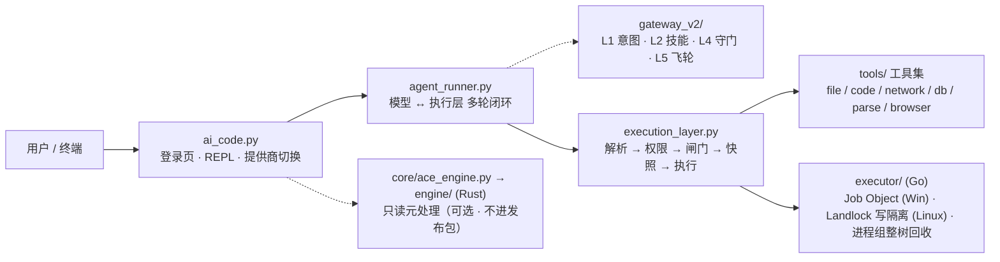

# 架构（Architecture）

> 本文档承接原 README「项目结构」权威清单与架构分层（docs/design/README-RESTRUCTURE.md，v3.7）；**架构图与完整目录树以本文档为准**（README 只给一句话概览，然后链到这里）。

## 架构图（GitHub 直接渲染）



实线是**执行路径**，虚线是**旁路增强**：Gateway 与元处理引擎都**不持有执行权**，坏掉只损失增强（前者降级为无策略辅助，后者退回纯 Python 同口径实现），不会放宽任何闸门。

## 1. 分层职责

| 层 | 组件 | 职责 |
|---|---|---|
| 用户层 | `ai_code.py` | 登录页、聊天 REPL、斜杠命令、提供商切换（纯终端，编辑器无关） |
| 交互循环 | `agent_runner.py` | 模型 ↔ 执行层多轮闭环；格式错误 / 守门 / 诱饵自动回喂修正，最多 20 轮 |
| 模型网关 | `gateway_v2/` | L1 意图 → L2 技能 → L4 守门（8 规则）→ L5 飞轮（SFT 数据） |
| 执行层 | `execution_layer.py` | 单轮 `_stage_*` 状态机（14 阶段，RoundCtx 本轮上下文）；协议解析、权限裁决、安全闸门、快照与守门串联 |
| 工具集 | `tools/` | registry 单点声明（name/schema/权限组/handler）+ 按域拆分的执行器 |
| 表现层 | `ui/` | 调色板 / 搜索式选择器 / 结果卡片 / 滚动引擎 / i18n（只负责画，不参与裁决） |
| 操作者工具 | `cli/` | 环境自检（doctor）、上下文压缩判定、会话事件日志 |
| 支撑模块 | `core/work.py` `core/guardian.py` `core/archive.py` `core/nuwa.py` | 诱饵/AST 行为检测、物理快照回滚（HMAC）、SimHash 记忆、POC 报告 |

## 2. Gateway 与执行层的关系（真话）

**Gateway 不是独立的安全流水线，不独自持有执行权。** 它是执行层在每轮内调用的策略/辅助层：

- `L1 意图识别 + L2 技能推荐`：仅在新输入时计算一次并缓存（`_stage_route`）；
- `L4 守门`：模型产出经过文本守门与成功结果守门（`_stage_final_reply` / `_stage_output_guard`，违规回滚本轮快照）；
- `L5 飞轮`：守门违规落盘为 SFT 数据（`flywheel_path`）。

上面的架构图以虚线（旁路）连接 Gateway 与交互循环，即表达此意——每轮裁决的强制边界仍在 `execution_layer.py`。

## 3. 完整目录树（权威）

```
ace-agent/
├── ai_code.py                  # 命令行前端：登录页 / REPL / 斜杠补全 / 提供商注册表 / goal 续跑 / 会话恢复
├── agent_runner.py             # 交互循环：模型 ↔ 执行层多轮闭环，错误自动回喂，工具结果确定性裁剪
├── execution_layer.py          # 执行层主入口：单轮 _stage_* 状态机（RoundCtx）；协议解析、权限、安全闸门、Plan Mode、全链路日志
├── ui/                         # 表现层：终端渲染与交互（只画，不裁决）
│   ├── __init__.py             #   包入口
│   ├── ace_theme.py            #   语义调色板（dark/light 自动检测）
│   ├── ace_selector.py         #   搜索式选择器（/model /provider 输入即过滤）
│   ├── ace_cards.py            #   工具结果卡片（状态+参数+折叠输出）
│   ├── ace_text.py             #   终端文本宽度（CJK 占两列，ANSI 零宽）：按列截断/补齐，卡片与选择器共用
│   ├── ace_panel.py            #   宽度感知排版：面板框/左右分栏/分组菜单（首屏与聊天头部、--preview 共用）
│   ├── ace_diff.py             #   工具改动的 diff：上色规则与增删统计（改动可见）
│   ├── ace_input.py            #   输入行交互：粘贴折叠 / ! bash 模式 / 暂存 / 快捷键表（纯函数）
│   ├── ace_markdown.py         #   回答正文渲染：Markdown 受控子集 + 流式按行渲染（纯函数，styler 可注入）
│   ├── ace_dialog.py           #   统一对话框：单选/多选/分组/进度/页签 + 向导框架（纯模型 + 纯渲染）
│   ├── ace_layout.py           #   布局/状态行/上下文可视化/任务树/首屏动效（纯函数，可配置分段）
│   ├── ace_fullscreen.py       #   备用屏幕全屏会话：滚动区 + 状态行 + 输入行（输出经 stdout 收集器入列）
│   ├── ace_menu.py             #   补全菜单模型：候选来源/排序/回车语义（两条渲染路径共用）
│   ├── ace_spinner.py          #   等待指示器状态机：阶段字形/速度 + 卡住渐变 + 无动效降级
│   ├── ace_notify.py           #   通知排队（优先级/去重/TTL）+ 终端标题与桌面通知通道
│   ├── ace_grace.py            #   危险对话框的防误触宽限期：飞行按键不算放行（纯逻辑，时钟可注入）
│   ├── ace_tools.py            #   工具看板：四态点（排队/在跑/完成/失败）+ 同帧同步 + 只重画变化行
│   ├── ace_turn.py             #   一轮的交互状态机：忙时入队、两段式中断、授权选项、档位环（纯逻辑）
│   ├── ace_home.py             #   主页模型：分区顺序（接着上次→开始→能力→特色）+ 条目 + 渲染（纯逻辑）
│   ├── ace_keys.py             #   键位系统（内置语义键 + 用户覆盖 + 冲突警告 + **作用域/和弦/生成的帮助**）
│   ├── ace_prompt.py           #   无依赖输入行：菜单 + 历史 + 行编辑（按键来源可注入，可端到端测）
│   ├── ace_vim.py              #   vim 子集：motions/operators/text objects + 行编辑器（纯函数）
│   ├── ace_term.py             #   终端能力探测（自动判定）+ 自检向导步骤
│   ├── ace_chatscroll.py       #   聊天内置滚动引擎(方案 C:视口只滚会话行)
│   ├── ace_cell.py             #   **唯一渲染目标**：Segment/Line/Screen + 网格常量 + problems()（规范验收）
│   ├── ace_canvas.py           #   帧缓冲 + 脏矩形：Cell/Canvas/diff/encode（"游戏引擎"那层，纯数据）
│   ├── ace_render.py           #   三个后端：终端 / 纯文本(golden) / SVG 预览；色深四档在这里
│   ├── ace_screen.py           #   主屏两车道：转录只写一次 + 底部区走脏矩形；会话主循环 run_session
│   ├── ace_host.py             #   引擎宿主：权限/确认/文本问答 → 内联面板（Question 状态机 + 跨线程泵）
│   ├── ace_engine_repl.py      #   把 REPL 接到引擎上（`--engine`，真终端下默认）：worker 跑轮次 + 队列回收输出
│   ├── ace_swatches.py         #   风格词典屏（瑞士风格试点）+ 13 组断言（含 golden 与帧预算）
│   ├── ace_widgets.py          #   边角小零件：状态图标六态 / 整宽分隔线(标题可居中) / 八分之一块进度条 / 快捷键提示 / byline / 方块小人
│   └── i18n.py                 #   轻量国际化（zh / en / ja 字典在根级 locales/）
├── frontend/                   # 主前端（TypeScript + Ink，独立进程）：经 `ace --serve` 的双向 NDJSON 协议驱动引擎；与 ui/ 并存，内部结构见 frontend/README.md
├── cli/                        # 操作者侧工具：自检 / 上下文 / 会话日志
│   ├── __init__.py             #   包入口
│   ├── ace_doctor.py           #   环境自检（python -m cli.ace_doctor）
│   ├── ace_context.py          #   上下文压缩判定：保住任务锚点，中间段折成摘要
│   ├── ace_sessionlog.py       #   会话事件日志：append-only JSONL，seq 契约，深冻结，replay 重建，链式 MAC（RG-02）
│   ├── ace_mandate.py          #   授权令操作者工具：签发/检查（python -m cli.ace_mandate issue|show）
│   └── ace_sessions.py         #   会话派生视图：摘要 / 切到第 n 轮 / rewind（纯函数）
├── core/                       # 引擎支撑：策略 / 网络 / 执行器客户端 / 记忆与快照
│   ├── __init__.py             #   包入口
│   ├── ace_execpolicy.py       #   命令三值判定（allow / prompt / forbidden），纯函数、可单测
│   ├── ace_net.py              #   出站请求闸门：全记录校验 + pin-to-IP + 逐跳复检（SSRF）
│   ├── ace_isolation.py        #   外部内容定界与来源标注（SEC-011）
│   ├── ace_http.py             #   模型调用的重试与退避（Retry-After + full jitter，纯判定可单测）
│   ├── ace_client.py           #   模型 HTTP 客户端：唯一的出网实现（OpenAI/Anthropic 两种格式 + tools 降级，两个前端共用，R-03）
│   ├── ace_executor.py         #   Go 执行器客户端（NDJSON 协议，纯 stdlib）
│   ├── ace_engine.py           #   Rust 元处理引擎客户端（会话事件流索引等；引擎不可用时降级为纯 Python 同口径实现）
│   ├── ace_taint.py            #   来源归属账本（RG-03 第一阶段：只测量不改裁决 —— 写目标有没有被用户提过）
│   ├── ace_recovery.py         #   可逆性分类器（RG-04 第一阶段：git/快照/可再生/不可重建/说不清；只分类不改裁决）
│   ├── ace_mandate.py          #   授权令（RG-05：签发/验签/意图·范围·可逆性下限·额度·TTL 四条判定；已接入 _stage_permission）
│   ├── ace_model.py            #   模型层纯逻辑：历史裁剪 / HTTP 错误码提示（两个前端共用，R-03）
│   ├── work.py                 #   诱饵工厂 + AST 行为检测（ASTDetector）
│   ├── guardian.py             #   物理快照回滚：快照 / 完整性预检 / HMAC / 自动清理
│   ├── archive.py              #   SimHash 记忆引擎（逐条容错加载 + 写回前与磁盘合并：单条坏/多实例并发都不会静默丢记忆；读不出来的原文隔离成 .corrupt-*）
│   ├── nuwa.py                 #   POC 报告（HTML + JSON）
│   ├── universal_document_parser.py # N 合一文档解析 + 懒加载 + 50MB 防线
│   ├── ace_mcp.py              #   MCP 客户端：stdio JSON-RPC 2.0（握手 / tools-list / tools-call + 子进程生命周期）
│   ├── ace_mcp_server.py       #   MCP **服务端**（ace --mcp）：把执行层借给外部 host；白名单暴露面 + JSON-RPC 错误语义（isError 与协议错误分开）
│   ├── ace_secscan.py          #   WP-11 路径级静态安全扫描（判据复用 sensitive.py 同一份名单；SEC-022 范围声明）
│   ├── ace_cubesandbox.py      #   WP-11 CubeSandbox 薄客户端（Tier-0 铁律：不可达即拒；e2b SDK 可选装）
│   ├── ace_hooks.py            #   事件钩子：session_start / user_prompt / pre_tool / post_tool / session_end（JSON 进出）
│   ├── ace_commands.py         #   自定义斜杠命令（.ace/commands/*.md）与插件目录（.ace/plugins/*）
│   ├── ace_events.py           #   headless 事件流（ace --json）：事件契约 + schema 校验 + notice 代理
│   ├── ace_serve.py            #   双向 NDJSON 协议服务端（ace --serve）：帧编解码 + 派发 + 审批往返，给独立进程前端用
│   ├── ace_todos.py            #   逐项待办清单（纯状态机 + 事件日志重放）
│   ├── ace_workspace.py        #   WP-4 工作区四层：Task→Workspace→Session→ExecutionProcess + allowedRoots 注册表（纯逻辑，回滚只经 /undo）
│   ├── ace_agents.py           #   WP-6 agent 预设：agents/*.md 扫描 + 四维权限投影 + **S-1 只许更严**（复用 RelaxationForbidden）
│   ├── ace_cost.py             #   成本估算：价格表（子串匹配）+ $ 计算（估算，非账单）
│   ├── ace_patch.py            #   最小 unified diff 应用器（/review 回填用）
│   ├── ace_styles.py           #   输出风格预设：提示词片段 + 界面旗标（一份预设两个面）
│   ├── ace_effort.py           #   思考强度：auto/low/medium/high/max + 提示词增量 + 关键词逃生门（纯逻辑）
│   ├── ace_io.py               #   终端编码两道防线：不崩（UTF-8+replace）· 不乱（按控制台代码页降级字形）
│   ├── ace_rules.py            #   持久授权规则：匹配/优先级/三档作用域（deny 优先，纯函数）
│   ├── canonical.py            #   路径规范化：解析到 OS 最终路径（8.3 短名/尾点/大小写/.. 一并归一，H-10）
│   ├── sensitive.py            #   敏感名单唯一来源：①能碰吗（sensitive_target）②内容是秘密吗（is_credential_file），H-11
│   ├── targets.py              #   破坏性目标唯一入口：destructive_targets（file_move 的 source 也在内，H-13）
│   ├── ace_claims.py           #   「模型声称完成了操作」的措辞判据（编排层与执行层共用，H-20）
│   ├── ace_contracts.py        #   两份方法论契约（ACC-02/03）：指标语义五要素 / 缺陷可达性六要素 + 五种偷换的判据
│   ├── ace_prefix.py           #   前缀稳定性与工具面伸缩（WP-3）：SHA-256 前缀指纹 / 变化强制归因 / 恒等快路径 / ToolSurfaceBudget
│   ├── ace_ledgers.py          #   两个账本（DL-03 拒绝账本 / HL-01 失败账本）：同键 (goal_id,fingerprint,class) 不同命 + 五级阶梯（HL-02）
│   └── version.py              #   版本单源 __version__（徽章 / 横幅 / doctor / CHANGELOG 对齐）
├── executor/                   # Go 执行器：Windows Job Object / Linux Landlock 写隔离 + seccomp 网络默认拒绝 / 三平台进程组整树回收（官方产物 ace --install-executor；或自编译）
├── engine/                     # Rust 内置计算引擎：分词/指纹/召回等**无裁决权**的纯计算 sidecar（NDJSON，同 ADR-002；不碰文件系统、不判权限）

├── tools/                      # 工具执行器包（清单与权限以 tools/registry.py 为准）
│   ├── __init__.py             #   包入口：组合各域 mixin 的 ToolExecutor（__all__ 导出）
│   ├── registry.py             #   工具唯一声明处（name / schema / 权限组 / handler）
│   ├── result.py               #   ExecutionResult 结果类型
│   ├── status.py               #   错误码/状态码唯一目录（Q-10 契约，散落字面量由守卫拒绝）
│   ├── base.py                 #   共享助手 + 敏感目标判定 + execute 分发
│   ├── file_common.py          #   file_ops / terminal_view / terminal_exec 共享常量（R-02）
│   ├── file_ops.py             #   文件与检索（读/写/删/移/局部替换/grep/glob/open/edit）
│   ├── terminal_view.py        #   只读终端查看（白名单命令，内建实现不经 shell）
│   ├── terminal_exec.py        #   命令执行（三值判定 + 审批闸门 + Go 执行器边界）
│   ├── file_tools.py           #   兼容层：FileTools = FileOps + TerminalView + TerminalExec
│   ├── code_tools.py           #   代码执行（AST 白名单 + Go 执行器/docker 边界）
│   ├── web_tools.py            #   网络/搜索/search_read/Playwright 浏览器
│   ├── db_tools.py             #   SQLite 读写
│   ├── notify_tools.py         #   通知（console/file/toast）
│   ├── parse_tools.py          #   文档解析（Word/Excel/PPT/PDF/OCR）
│   ├── goal_tools.py           #   持久目标状态机（revision CAS / blocked 白名单 / 轮次驱动）
│   ├── git_ops.py             #   git 工具族（8 个 git_* 工具：只读 5 / 写 3 分档，WP-2）
│   ├── subagent_tools.py       #   子代理（spawn/fork，独立工具执行循环）
│   ├── skill_tools.py          #   文件式技能库（SKILL.md 目录扫描）
│   ├── kb_tools.py             #   自定义知识库（kb_search/kb_add/kb_list）
│   └── docker_sandbox.py       #   容器执行层（--sandbox docker）
├── gateway_v2/                 # 网关包：intent(L1/L2) · guard(L4) · flywheel(L5)
├── locales/                    # 国际化字典（zh / en / ja JSON），由 ui/i18n.py 读取
├── prompts/                    # 系统提示词：v7 完整版 · v8 精简版 · tools 原生调用版
├── skills/                     # Skill 系统（WP-7）：skills/<name>/SKILL.md + scripts/references/assets；只广告 name+description，正文按需加载
├── test_all.py                 # 全模块端到端测试（纯 stdlib，断言数随平台浮动）
├── benchmarks/                 # 实测基准：bench_core.py 一键复现，results/ 存报告（正确率/延迟/吞吐）
├── e2e/                        # 端到端冒烟：real_model_smoke.py（真实厂商端点，ACE_E2E_*）/ r03_contract_smoke.py（假端点钉双前端输出契约）/ rg_probes.py（RG 安全结论的复现脚本：快照伪造 / 台账篡改 / 来源归属 / 可逆性分布）/ mcp_probe.py（假装 MCP host 跟真的 `ace --mcp` 子进程说话：stdout 纯度 / EOF 收工 / 裁决与台账）/ rel03_native_smoke.ps1（ace.cmd→真实控制台）
├── demo/                       # README 演示动画 + 录制脚本 + 2 分钟视频剧本（VIDEO-SCRIPT.md：分镜表 / 三种录法 / 不许出现的说法）
├── examples/                   # 场景剧本：安全实验室 / 文档解析 / 多轮任务
│   ├── README.md               #   索引：三场景 × 目标 / 前置 / 该看什么
│   ├── 01_security_lab/        #   权限裁决 + 写前快照 + /undo 回滚 + terminal_exec 逐次确认
│   ├── 02_document_parsing/    #   文档解析与读取边界（drop_docs_here/ 放文件，内容不入库）
│   └── 03_multi_turn_agent/    #   持久目标 + 子代理 + 知识库（附 config.example.json）
├── assets/logo.svg             # 标识「互」几何构图（原创，无第三方素材，非游戏素材描摹）
├── assets/ace.ico              # 由 logo.svg 生成的多尺寸图标（packaging/make_icon.py，7 个尺寸）
├── assets/repo-social-preview.png  # GitHub 仓库卡片图（1280×640，Settings → Social preview 上传用）

├── docs/                       # 文档（README 是入口，索引见 docs/README.md）
│   ├── README.md               #   文档索引：按"想干什么"分流全部文档
│   ├── BOOTSTRAP.md            #   一条命令跑起来（三条路：Docker / 源码 setup_env / 预编译 exe；三个经典环境坑及其真因）
│   ├── CAPABILITIES.md         #   核心能力概览（执行安全 / Agent 能力 / 可选与实验性）
│   ├── WHY.md                  #   为什么是 HooH（名称说明 / 对比提示词护栏 / 设计取向 / 设计参考）
│   ├── NAMING.md               #   改名决策：候选与被否掉的（order/希腊/门神）、落地清单、HooH 的知识产权口径
│   ├── HANDOFF.md              #   工程债与交接（还没做完的 + 仍未验证 + 为什么停在这里）
│   ├── GETTING-STARTED.md      #   上手路径：5 分钟跑起来 + 三维度矩阵 + 十个坑 + 去哪深入
│   ├── SHOWCASE.md             #   演示与截图：landing / 完整一轮 / diff 卡片 / 执行层拒绝（全部来自真实 --mock 会话）
│   ├── releases/               #   逐版本更新介绍（RELEASE-NOTES-vX.md，可直接贴进 GitHub Release）
│   ├── HANDOFF-R-03.md         #  R-03（双前端客户端合并）的交接提示词：自包含、可直接粘给另一个会话
│   ├── HANDOFF-FRONTEND.md     #  Ink 前端（frontend/ + ace --serve）的交接提示词：自包含、含「未完成/未验证」清单
│   ├── TUI-DESIGN-STUDY.md     #  TUI 设计研读：29 个 agent 仓库的界面实现对照（我们学什么 / 不学什么）
│   ├── TUI-ENGINE.md           #  界面引擎决策：主屏两车道为什么赢、组件化全屏（Textual）为什么删
│   ├── TUI-SWISS-SPEC.md       #  瑞士主义界面规范：六条不可协商 + 网格 + 层级工具箱 + 验收
│   ├── CLAUDE-CODE-TUI-AND-SWATCH-PLAN.md #  早期方案稿：Claude Code TUI 与 Swatch 的移植计划
│   ├── HOME-DESIGN.md          #  主页设计：分区顺序为什么是这样、每条信息为什么在这个位置
│   ├── KEYMAP-CLAUDE-PARITY.md #  键位对照表（Claude Code ↔ HooH，逐条核实 + 不做的理由）
│   ├── ARCHITECTURE.md         #   本文档：分层职责 + 权威目录树 + ADR 索引
│   ├── security/               #   安全文档（模型 / FAQ / 审计 / 自查扫描）
│   │   ├── SECURITY-MODEL.md       #   安全模型：权限/隔离/路径/网络/沙箱 + 生产部署必读
│   │   ├── SECURITY-FAQ.md         #   安全边界 FAQ（11 问：挡住了什么/没挡住什么；含无人值守 fail-close 与快照不覆盖清单）
│   │   ├── SECURITY-AUDIT.md       #   安全审计（OWASP + STRIDE；部分条目与现码漂移，以代码为准，见 BACKLOG SEC-*）
│   │   └── SECURITY-SCAN-2026-10-04.md # 自查扫描记录：ace_security_scan 扫本仓库（路径级 259 条全为未跟踪生成物 / dist 内容级 0 条凭据命中 / 两条工具反馈）
│   ├── CONFIGURATION.md        #   配置全项：config 键 + 出站白名单/检索/编码/DB 边界
│   ├── COMMANDS.md             #   命令参考：斜杠/@ 全表 + 启动参数
│   ├── EXTENDING.md            #   扩展点：事件钩子 / 自定义命令 / 插件 / MCP（边界写清楚）
│   ├── TESTING.md              #   测试：全量/CI 矩阵/基准/e2e/ruff
│   ├── DEVELOPMENT.md          #   开发者标准化流程（改代码到推送八步 + 新增工具八步清单）
│   ├── INTERFACES.md           #   接口与类型契约（文本协议/状态码/注册表/权限模型/网络）
│   ├── adr/                    #   架构决策记录
│   │   ├── ADR.md                  #   内联序列 001-006
│   │   └── ADR-002-executor-boundary.md  #   执行器进程边界 / NDJSON 协议 / Windows 沙箱选型
│   ├── BACKLOG.md              #   待办事项（P0 安全 / P1 快速项 / P2 结构 / REL）
│   ├── BACKLOG-P2.md           #   P2 重构立项卡(R-01~R-05 范围/验收/顺序,供新会话照做)
│   ├── ROADMAP.md              #   能力路线图（对照 29 个参照系的产品面缺口 / 语言裁决 LANG-* / 工作面 WP-0~WP-10 / 批次与验收门槛）
│   ├── MCP-SERVER.md           #   ace --mcp 使用说明：三种 host 的配置片段 / 两个旋钮（权限档 + 授权令）/ 排障 / 真 host 冒烟清单
│   ├── PACKAGING.md            #   打包与分发评估（Q-13 结论:源运行,布局重构后再 wheel）
│   ├── PACKAGING-EXE.md        #   Windows 发行包：PyInstaller 单目录 + 冒烟门禁 + 冻结后能力表
│   ├── design/                 #   立项卡（已闭环的历史设计决策 + 在途：THREE-LAYERS / WP-0 / ACC）
│   │   ├── WP-0-FRONTEND-CONVERGENCE.md #   前端收敛立项卡（批次 0 前置：重复点名 / 协议消费 / 打包三选一；含两处与 ROADMAP 转述的差异）
│   │   ├── ACC-GATES.md            #   验收门槛立项卡（ACC-01~04：自报 token ↔ 实测 / 指标语义五要素 / 缺陷可达性六要素 / 五种偷换）
│   │   ├── CREDENTIAL-HANDLING.md  #   凭据回显边界立项卡（H-33~H-35：向导 hidden 全程丢失 / 两条泄漏路径 / 断言只钉声明）
│   │   ├── EXECUTOR-RELEASE.md     #   执行器发布通道（预编译二进制 + ace --install-executor）
│   │   ├── README-RESTRUCTURE.md   #   README 瘦身两轮立项（本结构由此演进）
│   │   └── ARCH-TREE-CHECK.md      #   权威树一致性校验（Q-06：R1-R4 规则 / 实测缺口 / S1-S4）
│   │   ├── STRUCT-REFACTOR.md      #   P2 结构重构立项卡（R-01~R-05 实测规模 / 顺序 / 验收）
│   │   ├── SAFETY-HARDENING.md     #   安全边界加固立项卡（H-01~H-22 审计证据 / 工作包 / 验收）
│   │   └── RGTC-LANDING.md         #   RGTC 落地立项卡（RG-01~RG-05：信任锚外移 / 链式台账 / 来源归属 / 可逆性分类器 / 授权令与影子）
│   │   └── MCP-SERVER.md           #   MCP server 立项卡（外部 host 借执行层：暴露面 / 审批矩阵 / 非目标 / 验收）
│   │   ├── CONFIRM-BOUNDARY.md     #   确认与只读边界加固立项卡（H-27~H-31：前缀免确认 / 确认对象 / 只读越界 / 无边界不执行）
│   │   ├── THREE-LAYERS.md         #   三层脊柱设计卡（DL 驱动 / RL 响应 / HL 自愈；两个共用账本 / 五级升级阶梯 / 拒绝六分类 / 验收 A1-A8）
│   │   ├── WP-0-TAIL-TECH.md        #   WP-0/ACC 尾活技术难点与解法（切片 C 终端权限提示统一 + benchmarks 校验器接法）
│   │   ├── WP-4-SNAPSHOT-SEMANTICS.md #  WP-4 前置：快照语义统一（C5：worktree 与既有回滚不能是两套）
│   │   ├── WP-6-AGENT-PRESETS.md    #   WP-6 立项卡（C4 要求单独立卡）：per-agent 权限预设 + **S-1 只许更严**
│   │   ├── WP-9-SANDBOX-BACKEND.md  #   WP-9 立项卡（C6：**SEC-020**）：三层沙箱 + S-1 边界（可外包执行边界，不可外包决定权）
│   │   └── ACE-MCP-SEC-SUBAGENT.md  #   WP-11 立项卡（**SEC-022**）：HooH 作为 MCP 安全子层 + 共用 CubeSandbox 底座
│   │   ├── TUI-PRIOR-ART.md       #   同行研读：pi 与 Claude Code 的界面源码（控制层 / 设计系统 / 可搬清单）
│   │   ├── UI-OVERHAUL.md         #   界面重做立项书（现状取证 / 路线 A·B·C / 分期 / 可执行验收 / 明确不做）
│   │   └── DshShell-AceCapabilities.md # 整壳换 DSH TUI 后 ace 六项本体的露出设计卡（CAP-01~07：逐能力落点 / 优先级 / 最小新协议面 / 验收 / 上游冲突；§0 范围决定（ui/ 保留为降级路径）/ §3.7 引擎先行项（会话浏览器·树·设置的数据源）/ §6 前置门 G1（IME 候选框）与落点勘误（PageMargin 合并 · ui.js 唯一公开面 · 内核 vendor 落点））
│   └── history/                #   会话纪要 / 调研 / 规范历史
│       ├── SESSION-2026-09-06.md   #   评审会话纪要（风险清单→决策→提交→OPEN）
│       ├── UI-CHAT-SCROLL.md       #   聊天内置滚动立项卡(引擎已实现,接线待真机)
│       ├── codex_research.md       #   Codex 源码调研（45+ 可借鉴设计）
│       ├── dsh_research.md         #   DeepSeek Harness 源码调研（62 项可借鉴设计）
│       └── prompt-engineering/     #   提示词工程规范 v1→v7 + 上下文包（历史归档）

├── README.md                   # 项目名片与上手入口（**英文为主**；架构级短树，权威树见本文档）
├── README.zh-CN.md             # 中文版 README（与英文版同源，顶部互相切换）
├── CONTRIBUTING.md             # 贡献指南（环境 / 测试 / 风格 / PR 流程）
├── LICENSE                     # MIT
├── CHANGELOG.md                # 逐版本更新日志（Keep a Changelog 风格）
├── SECURITY.md                 # 安全策略：漏洞报告流程 / 承诺 / 已知边界
├── THIRD-PARTY-NOTICES.md      # 第三方许可证索引：vendor/ 里 16 个 wheel 的署名与义务（MPL-2.0 / Apache-2.0 等）+ 派生源码与文案的来源（dsh-TUI，MIT）
├── requirements.txt            # 依赖清单（安全核心零依赖，模型调用需 requests）
├── setup_env.py                # 运行环境一键准备：多环境发现 + 真的 import 一次 + 离线 wheel
├── vendor/                     # 离线依赖落点（放 wheel 即可离线安装；README 说明口径）
├── third_party/                # 第三方来源落点：许可全文与归属声明（**只放许可，不放源码**）
│   └── dsh-tui/                #   dsh-TUI（@deepseek-harness-tui/dsh-tui v0.12.0，MIT，© 2026 chimney (ccch1mneyyy)）
│       ├── LICENSE             #   上游 LICENSE 逐字副本（MIT 全文 + 版权行，不得改动）
│       ├── NOTICE.md           #   已引入的范围 / 逐条上游归属（Ink · pi · Yoga · dsh-ui-whale…）/ 未核实项（vendor/dsh-std）
│       └── upstream/           #   闭包内派生自其它上游的许可全文（只按实际 vendor 的 135 文件判定，不按上游 src/ 全目录）
│           ├── README.md       #   文件↔上游对应表 / 文本来源与逐字性 / 待核实项（Ink 分叉基线版本）
│           ├── INK-LICENSE.txt #   Ink（vadimdemedes/ink，MIT）逐字文本；覆盖 lib/types/ink/** 120 文件
│           └── YOGA-LICENSE.txt #  Meta Yoga（facebook/yoga，MIT）逐字文本；覆盖 native-ts/yoga-layout/** 2 文件
├── packaging/                  # 发行打包：ace.spec + build_exe.ps1（PyInstaller 单目录 + 冒烟门禁）/ make_wix.py + build_installer.ps1（WiX MSI 安装包 + 便携 zip）/ make_icon.py（logo.svg → ace.ico，纯标准库光栅化）/ check_packaging.ps1（提交前脚本自检）
├── ace.cmd                     # Windows 启动器（向 setup_env 问路挑解释器，防商店占位）
├── hooh.cmd                    # 同一入口的新名字转发器（cmd /c 起子进程；call 会让 Ink 前端 0xC0000409 退出）
├── Dockerfile                  # 整体镜像入口（三档细目在 docker/）
├── docker-compose.yml          # 整体镜像一键起停编排
├── .gitignore                  # 忽略规则：生成物 / 缓存 / 密钥
├── .gitattributes              # 行尾策略：*.cmd / *.bat 固定 CRLF（-text，防 cmd.exe 错位重读）
├── .dockerignore               # 构建上下文忽略
├── docker/                     # lite / standard / full 三档整体镜像 + sandbox 执行镜像 + 模型下载脚本
├── evidence-pack/              # 公开时间线证据包：HooH 公开 commit/tag/release 的可复核时间线调研（用法与不确定项见其 README.md）
└── .github/                    # 仓库协作配置
    ├── workflows/              #   ci.yml（测试/ruff/Go/bench/e2e/容器 smoke）+ release-executor.yml（预编译执行器产物）+ release-exe.yml（Windows 单目录发行包）
    ├── ISSUE_TEMPLATE/         #   bug / feature 议题模板
    ├── RELEASE-ANNOUNCEMENT-v3.45.0.md  #   中英双语发布公告（**英文在前**，可直接当 Release 说明 / 投稿 HN；本版：安全边界再加固 H-27~H-32 + 入口重做）
    ├── RELEASE-ANNOUNCEMENT-v3.44.0.md  #   中英双语发布公告（可直接当 Release 说明；本版：MCP server —— 把自己交给别人的 agent）
    ├── RELEASE-ANNOUNCEMENT-v3.43.0.md  #   中英双语发布公告（可直接当 Release 说明；本版：信任锚外移 / 链式台账 / 只测量的两条判据）
    ├── RELEASE-ANNOUNCEMENT-v3.42.0.md  #   中英双语发布公告（可直接当 Release 说明；本版：执行层承诺对齐 / 元处理内核 / 运行度量）
    ├── RELEASE-ANNOUNCEMENT-v3.41.0.md  #   中英双语发布公告（可直接当 Release 说明）
    └── pull_request_template.md#   PR 模板
```

> 维护纪律：树里出现的每个路径必须真实存在，仓库根级与"已展开目录"的直接子项必须登记（BACKLOG Q-06）。该约束由 `test_all.py` 的 `[38] 文档/仓库结构一致性` 自动校验——删文件、加文件、改树名都会让测试变红。

## 4. 深入文档索引

| 想了解 | 去这里 |
|---|---|
| 为什么这么设计（SimHash / 双层协议 / 零依赖） | `adr/ADR.md`（内联序列 001-006） |
| 执行器进程边界 / NDJSON / Windows 沙箱选型 | `adr/ADR-002-executor-boundary.md` |
| 协议/状态码/注册表/权限模型/网络契约 | `INTERFACES.md` |
| **安全边界 FAQ（挡住了什么、没挡住什么）** | `security/SECURITY-FAQ.md` |
| 安全机制与边界 | `security/SECURITY-MODEL.md` + `security/SECURITY-AUDIT.md`（审计） |
| 配置项与机制说明 | `CONFIGURATION.md` |
| 能力路线图与三层脊柱设计 | `ROADMAP.md` + `design/THREE-LAYERS.md` |
| 提示词规范演进 | `history/prompt-engineering/` |
| 测试与 CI | `TESTING.md` |
| 开发流程与规范 | `DEVELOPMENT.md` + `CONTRIBUTING.md` |
